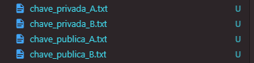
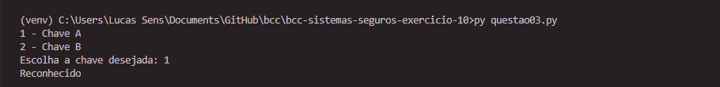
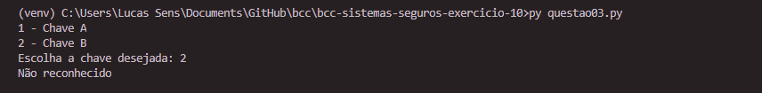

# Desenvolvimento de Sistemas Seguros - Exercício 10

Fundação da Universidade Regional de Blumenau

Alunos: 
* Francisco Lucas Sens
* Gabriel Castellani de Oliveira

[Conteúdo](assets/17-AssinaturaDigital.pdf)

# Enunciado: 
Solucione as questões abaixo e submeta no AVA o código fonte, bem como um documento no Word print screen das saídas das questões abaixo.

## Questão 1

Crie dois pares de chaves (par de chaves A e par de chaves B) e armazene-os em disco.

**Resposta:**

## Questão 2

Crie um programa que possibilite que o usuário forneça um documento para assinar. Utilize a chave de A para assinar a mensagem e armazene a assinatura em um arquivo binário.

**Resposta:**

## Questão 3

Crie um programa que valide a origem do arquivo. Experimente utilizar a chave de A para validar que a mensagem é de autoria de A.

**Resposta:** Apresentou mensagem dizendo que é reconhecido.

## Questão 4

Experimente utilizar a chave B para validar a autoria do arquivo. O que acontece?

**Resposta:** Não foi lancada nenhuma mensagem, somente apresentou que não é reconhecido.

